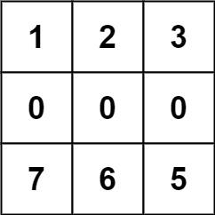

\675. Cut Off Trees for Golf Event

Hard

595349Add to ListShare

You are asked to cut off all the trees in a forest for a golf event. The forest is represented as an `m x n` matrix. In this matrix:

- `0` means the cell cannot be walked through.
- `1` represents an empty cell that can be walked through.
- A number greater than `1` represents a tree in a cell that can be walked through, and this number is the tree's height.

In one step, you can walk in any of the four directions: north, east, south, and west. If you are standing in a cell with a tree, you can choose whether to cut it off.

You must cut off the trees in order from shortest to tallest. When you cut off a tree, the value at its cell becomes `1` (an empty cell).

Starting from the point `(0, 0)`, return *the minimum steps you need to walk to cut off all the trees*. If you cannot cut off all the trees, return `-1`.

You are guaranteed that no two trees have the same height, and there is at least one tree needs to be cut off.

 

**Example 1:**


```
Input: forest = [[1,2,3],[0,0,4],[7,6,5]]
Output: 6
Explanation: Following the path above allows you to cut off the trees from shortest to tallest in 6 steps.
```

**Example 2:**



```
Input: forest = [[1,2,3],[0,0,0],[7,6,5]]
Output: -1
Explanation: The trees in the bottom row cannot be accessed as the middle row is blocked.
```

**Example 3:**

```
Input: forest = [[2,3,4],[0,0,5],[8,7,6]]
Output: 6
Explanation: You can follow the same path as Example 1 to cut off all the trees.
Note that you can cut off the first tree at (0, 0) before making any steps.
```

 

**Constraints:**

- `m == forest.length`
- `n == forest[i].length`
- `1 <= m, n <= 50`
- `0 <= forest[i][j] <= 109`

```python
class Solution: #O(VE^E) time O(E) space
    def cutOffTree(self, forest: List[List[int]]) -> int:
        import collections        
        # find trees locations and sort them in order
        m,n = len(forest), len(forest[0])
        treeLocs = []
        for i in range(m):
            for j in range(n):
                if forest[i][j] > 1:
                    treeLocs.append([i, j, forest[i][j]])
        treeLocs = sorted(treeLocs, key = lambda elem:elem[2])
        # add start point
        if forest[0][0] != treeLocs[0][2]:
            treeLocs = [[0,0,1]] + treeLocs
            
        # bfs to find next tree
        def bfs(curLoc, finLoc):
            nonlocal m,n,forest
            dq = collections.deque([curLoc + [0]])
            visited = set()
            while len(dq) > 0:
                curi, curj, h, step = dq.popleft()
                if h == finLoc[2]:
                    return step
                for nxt in [[curi+1, curj],[curi-1, curj],[curi, curj+1],[curi, curj-1]]:
                    if ( nxt[0] >=0 and nxt[0] < m and 
                            nxt[1] >=0 and nxt[1] < n and 
                            forest[nxt[0]][nxt[1]] > 0  and
                            (nxt[0], nxt[1]) not in visited ):
                        visited.add((nxt[0], nxt[1]))
                        dq.append([nxt[0], nxt[1], forest[nxt[0]][nxt[1]], step+1])
            return -1
        # use bfs find next tree and add steps
        if len(treeLocs) == 0:
            return -1
        res = 0
        for i in range(len(treeLocs)-1):
            steps = bfs(treeLocs[i], treeLocs[i+1])
            if steps == -1:
                return -1
            res += steps
        return res
```

