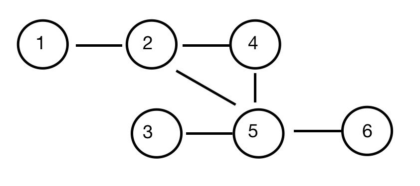

Amazon is trying to understand customer shopping patterns and offer items that are regularly bought together to new customers. Each item that has been bought together can be represented as an undirected graph where edges join often bundled products. A group of *n* products is uniquely numbered from 1 of *product_nodes*. A *trio* is defined as a group of three related products that all connected by an edge. Trios are scored by counting the number of related products outside of the trio, this is referred as a *product sum*.

Given product relation data, determine the minimum product sum for all trios of related products in the group. If no such trio exists, return -1.

**Example**
*products_nodes = 6*
*products_edges = 6*
*products_from = [1,2,2,3,4,5]*
*products_to = [2,4,5,5,5,6]*

| Product | Related Products |
| :-----: | :--------------: |
|    1    |        2         |
|    2    |     1, 4, 5      |
|    3    |        5         |
|    4    |       2, 5       |
|    5    |    2, 3, 4, 6    |
|    6    |        5         |



A graph of n = 6 products where the only trio of *related products is (2, 4, 5).*

*The product scores based on the graph above are:*

| Product | Outside Products | Which Products Are Outside |
| :-----: | :--------------: | :------------------------: |
|    2    |        1         |             1              |
|    4    |        0         |                            |
|    5    |        2         |            3, 6            |


In the diagram above, the total product score is 1 + 0 + 2 = 3 for the trio (2, 4, 5).

**Function Description**

Complete the function getMinScore in the editor below.

*getMinScore has the following parameter(s):*

  int products_nodes: the total number of products

  int products_edges the total number of edges representing related products

  int products_from[products_nodes]: each element is a node of one side of an edge.

  int products_to[products edges]: each products_to[i] is a node connected to products_from[i]

Returns:

int: the minimum product sum for all trios of related products in the group. If no such trio exists, return -1.

**Constraints**

- *1 <= products_nodes <= 500*
- *1 <= products_edges <= min(500, (products_nodes ** *(products_nodes - 1)) / 2)*
- *1 <= products_from[i], products to[i] <=* *products_nodes*
- *products_from[i] != products_to[i]*


Sample Case 0

STDIN    Funtion
-------    ------------------------------------------------
5  6   -> products_nodes = 5   products_edges = 6
1  2   -> products_from[0] = 1  products_to[0] = 2
1  3   -> products_from[1] = 1  products_to[1] = 3
2  3   -> products_from[2] = 2  products_to[2] = 3
2  4   -> products_from[3] = 2  products_to[3] = 4
3  4   -> products_from[4] = 3  products_to[4] = 4
4  5   -> products_from[5] = 4  products_to[5] = 5

Sample Output

2

Explanation

There are two possible trios: {1,2,3} and {2,3,4}

The score for {1,2,3} is 0 + 1 + 1 = 2.

The score for {2,3,4} is 1 + 1 + 1 = 3.

Return 2.

```
def solution(froms, tos):#O(VE)
    import collections
    # creat to sets O(V)
    toSets = collections.defaultdict(set)
    for i in range(len(froms)):
        fromN, toN = froms[i], tos[i]
        toSets[fromN].add(toN)
        toSets[toN].add(fromN)
    print(toSets)
    # find trios and calculate outer nodes  O(V)
    res = float('inf')
    for i in range(len(froms)): 
        fromN, toN = froms[i], tos[i]
        for curN in toSets[fromN]: #we have each fromN->toN pairs, now just check if toN->curN, while fromN -> curN 
            if curN in toSets[toN] and curN != toN:
                res = min(res, len(toSets[fromN])+len(toSets[toN])+len(toSets[curN])-6)
    return res if res < float('inf') else -1
print(solution([1,2,2,3,4,5], [2,4,5,5,5,6]))

def solution(froms, tos): O((VE)^2)
    import collections
    # creat to sets
    trios = collections.defaultdict(int)
    toSets = collections.defaultdict(set)
    for i in range(len(froms)):
        fromN, toN = froms[i], tos[i]
        toSets[fromN].add(toN)
        toSets[toN].add(fromN)
    print(toSets)
    # find trios and calculate outer nodes
    for key in toSets.keys():
        toSet = toSets[key]
        outerNum = len(toSet)-2
        outerNums = {}
        for nxtTo in toSet:
            nxtToSet = toSets[nxtTo]
            for nxtNxtTo in nxtToSet:
                if key in toSets[nxtNxtTo]: # a trio circle
                    triosKey = tuple(sorted([key, nxtTo, nxtNxtTo]))
                    outerNums[triosKey] = outerNum
        print(outerNums)
        for triosK in outerNums.keys():
            trios[triosK] += outerNums[triosK]
    print(trios)
    # get max score
    res = 0
    for key in trios:
        res = max(res, trios[key])
    return res
print(solution([1,2,2,3,4,5], [2,4,5,5,5,6]))


```

