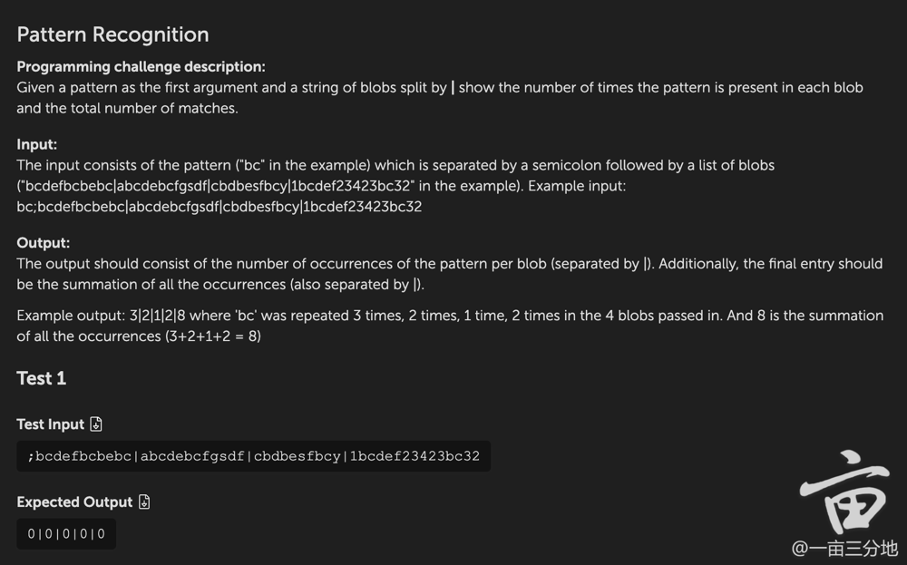
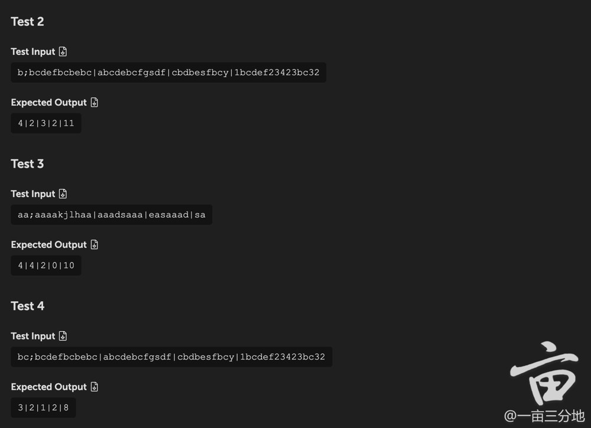

Programming challenge description:
Given a pattern as the first argument and a string of blobs split by | show the number of times the pattern is present in each blob and the total number of matches.


Input:
The input consists of the pattern (“bc” in the example) which is separated by a semicolon followed by a list of blobs (“bcdefbcbebc|abcdebcfgsdf|cbdbesfbcy|1bcdef23423bc32” in the example). Example input: bc;bcdefbcbebc|abcdebcfgsdf|cbdbesfbcy|1bcdef23423bc32


Output:
The output should consist of the number of occurrences of the pattern per blob (separated by |). Additionally, the final entry should be the summation of all the occurrences (also separated by |).


Example output: 3|2|1|2|8 where ‘bc’ was repeated 3 times, 2 times, 1 time, 2 times in the 4 blobs passed in. And 8 is the summation of all the occurrences (3+2+1+2 = 8)


Test 1
Test Input
Download Test 1 Input
bc;bcdefbcbebc|abcdebcfgsdf|cbdbesfbcy|1bcdef23423bc32
Expected Output
Download Test 1 Input
3|2|1|2|8
Test 2
Test Input
Download Test 2 Input
aa;aaaakjlhaa|aaadsaaa|easaaad|sa
Expected Output
Download Test 2 Input
4|4|2|0|10
Test 3
Test Input
Download Test 3 Input
b;bcdefbcbebc|abcdebcfgsdf|cbdbesfbcy|1bcdef23423bc32
Expected Output
Download Test 3 Input
4|2|3|2|11
Test 4
Test Input
Download Test 4 Input
;bcdefbcbebc|abcdebcfgsdf|cbdbesfbcy|1bcdef23423bc32
Expected Output
Download Test 4 Input
0|0|0|0|0



```python
def countPattern(string):
    pattern, target = string.split(';')
    n = len(pattern)
    strParts = target.split('|')
    res = []
    total = 0
    for strPart in strParts:
        count = 0
        for i in range(len(strPart)):
            if strPart[i:i+n] == pattern:
                count += 1
        total += count
        res.append(str(count))
    res.append(str(total))
    return "|".join(res)

print(countPattern("bc;bcdefbcbebc|abcdebcfgsdf|cbdbesfbcy|1bcdef23423bc32"))
```

