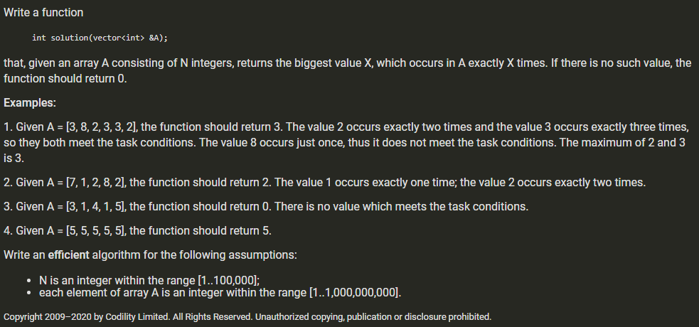

##### Largest number X which occurs X times



```python
def calMax(nums):
    import collections
    numDict = collections.defaultdict(int)
    res = 0
    for num in nums:
        numDict[num] += 1
    for key in numDict.keys():
        if key == numDict[key]:
            res = max(res, numDict[key])
    return res

print(calMax([1,2,2,3,3,3,4,4,4,4,5,5,5,5,5]))
```

